<div align="center">

# Crop Classification with Deep Learning

### Sentinel-2 Satellite Imagery | Elgabel Region, Sudan

[](https://python.org)
[](https://pytorch.org)
[](https://scikit-learn.org)
[](https://sentinels.copernicus.eu)
[](https://developer.nvidia.com/cuda-toolkit)
[](LICENSE)

[](https://github.com/Osman-Geomatics93/crop-classification-deep-learning/actions)
[](https://github.com/Osman-Geomatics93/crop-classification-deep-learning/commits/main)
[](https://github.com/Osman-Geomatics93/crop-classification-deep-learning)
[](https://github.com/Osman-Geomatics93/crop-classification-deep-learning/stargazers)
[](https://github.com/Osman-Geomatics93/crop-classification-deep-learning/releases)

---

**9 Models** | **24 Spectral Features** | **100% Accuracy** | **104 km² Classified**

</div>

Multi-class crop classification in the **Elgabel Region, Sudan** using Sentinel-2 satellite imagery and multiple machine learning / deep learning models. The pipeline covers data acquisition (Google Earth Engine), exploratory analysis, classical ML training (scikit-learn, XGBoost), PyTorch deep learning, and wall-to-wall satellite image classification.

---

## Table of Contents

- [Study Area](#study-area)
- [Workflow](#workflow)
- [Results](#results)
- [Data Exploration](#data-exploration)
- [Model Training Details](#model-training-details)
- [Data Description](#data-description)
- [Model Architectures](#model-architectures)
- [Project Structure](#project-structure)
- [Setup](#setup)
- [Usage](#usage)
- [Google Earth Engine](#google-earth-engine)
- [Contributing](#contributing)
- [Citation](#citation)
- [Changelog](#changelog)
- [License](#license)

---

## Study Area

**Elgabel Region, Sudan** — an agricultural zone where the following five crop/land-cover classes are mapped using Sentinel-2 imagery from Q1 2020:

| Class ID | Name   | Color | Samples | Percentage |
|:--------:|--------|:-----:|--------:|----------:|
| 0 | Cotton |  | 337 | 1.4% |
| 1 | Wheat |  | 7,901 | 32.2% |
| 2 | Fallow |  | 11,150 | 45.4% |
| 3 | Grass |  | 5,024 | 20.5% |
| 4 | Water |  | 144 | 0.6% |

> **Total:** 24,556 labeled samples | **Imbalance ratio:** 77.4:1 (Fallow vs Water)

---

## Workflow

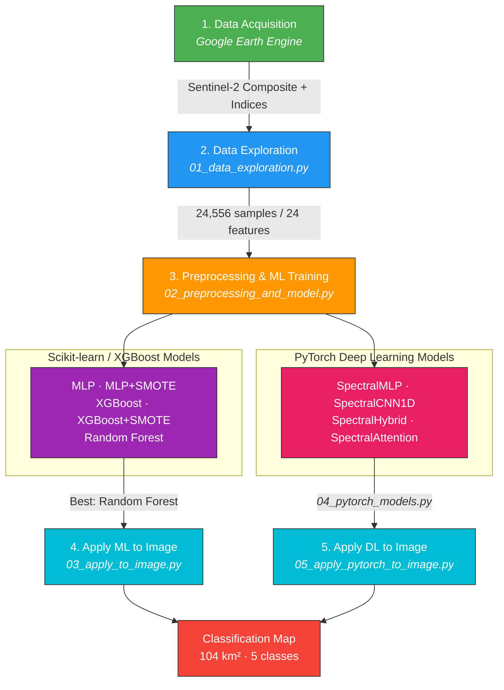

---

## Results

### Scikit-learn & XGBoost Models

| Model | Accuracy | Macro F1 | Weighted F1 | Kappa |
|-------|:--------:|:--------:|:-----------:|:-----:|
| MLP Neural Network | 99.98% | 0.9984 | 0.9998 | 0.9997 |
| MLP + SMOTE | 99.98% | 0.9984 | 0.9998 | 0.9997 |
| XGBoost | 99.98% | 0.9998 | 0.9998 | 0.9997 |
| XGBoost + SMOTE | 99.98% | 0.9998 | 0.9998 | 0.9997 |
| **Random Forest** | **100.00%** | **1.0000** | **1.0000** | **1.0000** |

### PyTorch Deep Learning Models

| Model | Accuracy | Precision | Recall | Macro F1 | Kappa | Parameters |
|-------|:--------:|:---------:|:------:|:--------:|:-----:|----------:|
| SpectralMLP | 99.96% | 0.9942 | 0.9996 | 0.9969 | 0.9994 | 78,853 |
| SpectralCNN1D | 99.49% | 0.9756 | 0.9964 | 0.9854 | 0.9922 | 40,069 |
| **SpectralHybrid** | **100.00%** | **1.0000** | **1.0000** | **1.0000** | **1.0000** | **43,717** |
| **SpectralAttention** | **100.00%** | **1.0000** | **1.0000** | **1.0000** | **1.0000** | **106,309** |

### Classification Maps

#### Random Forest (sklearn) — Satellite Image Classification
<p align="center">
  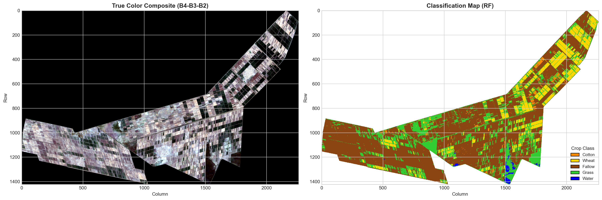
</p>

#### SpectralHybrid (PyTorch) — Satellite Image Classification
<p align="center">
  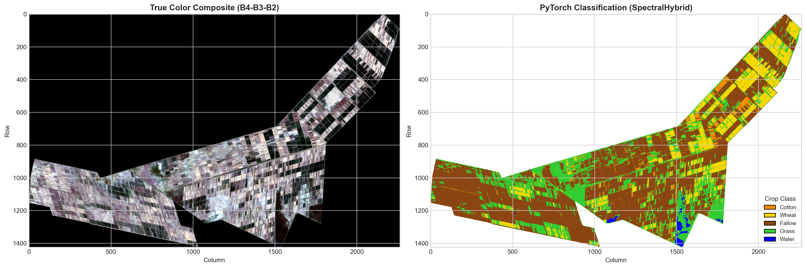
</p>

### Area Statistics (SpectralHybrid Model)

| Class | Area (ha) | Area (km²) | Percentage |
|-------|----------:|----------:|-----------:|
| Cotton | 463.0 | 4.63 | 4.4% |
| Wheat | 1,373.9 | 13.74 | 13.2% |
| Fallow | 5,839.9 | 58.40 | 55.9% |
| Grass | 2,672.5 | 26.73 | 25.6% |
| Water | 89.3 | 0.89 | 0.9% |

---

## Data Exploration

### Class Distribution
<p align="center">
  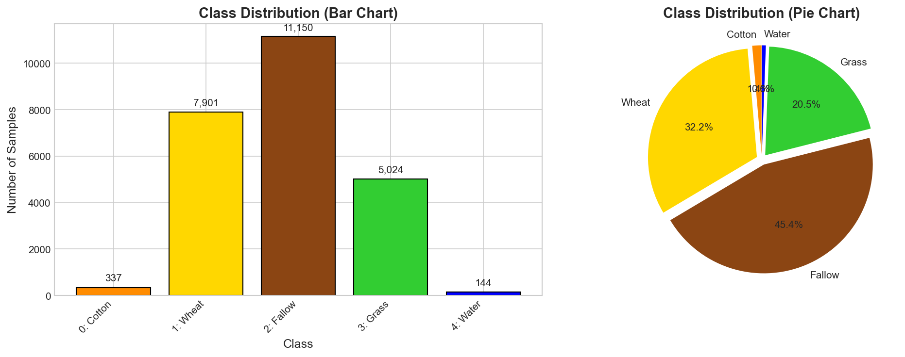
</p>

<details>
<summary><b>Feature Distributions by Class</b> (click to expand)</summary>
<br>
<p align="center">
  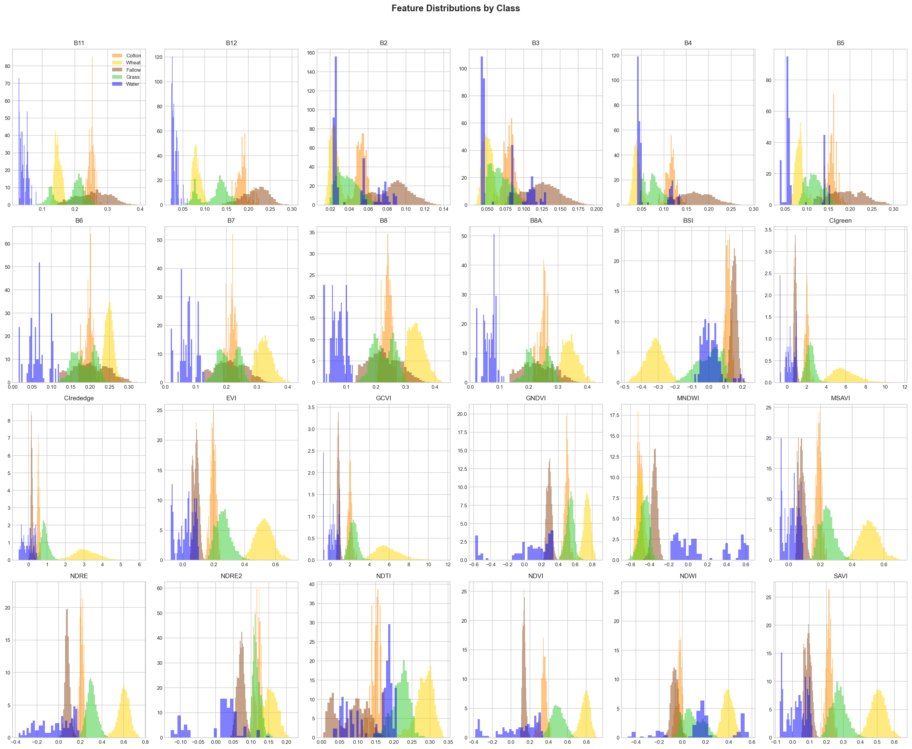
</p>
</details>

<details>
<summary><b>Key Features — Box Plots</b> (click to expand)</summary>
<br>
<p align="center">
  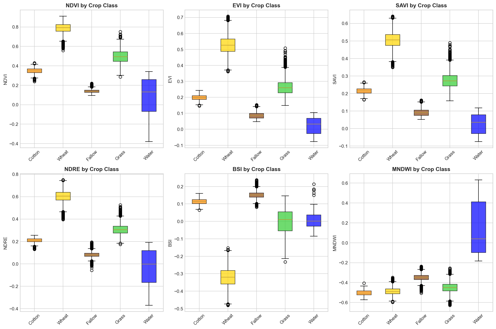
</p>
</details>

<details>
<summary><b>Feature Correlation Matrix</b> (click to expand)</summary>
<br>
<p align="center">
  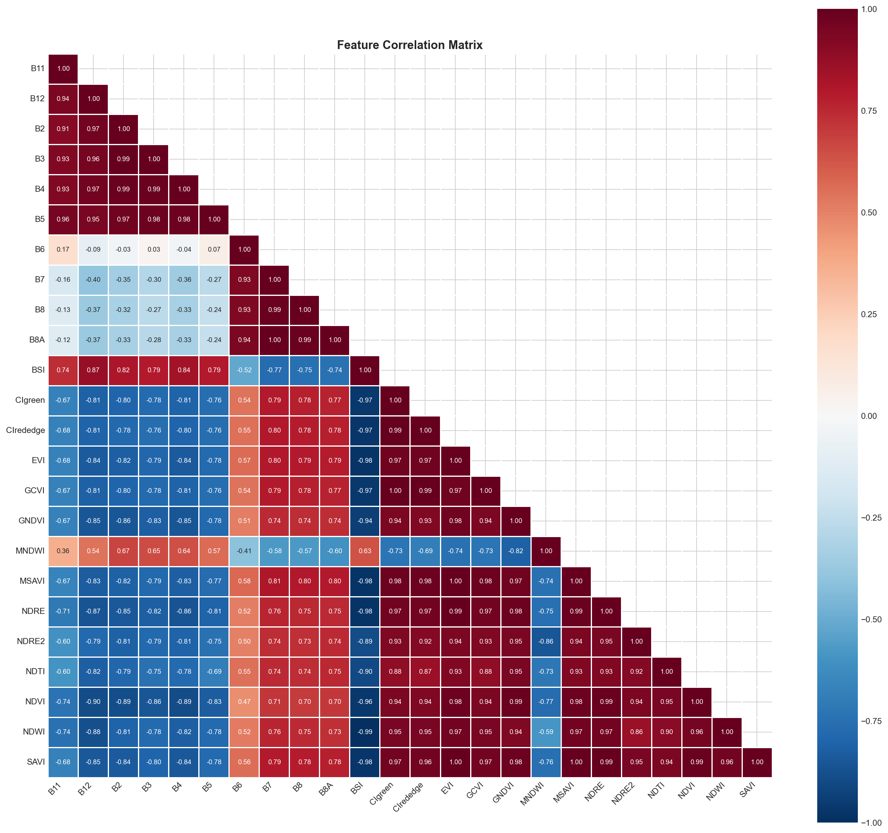
</p>

**Highly correlated feature pairs (|r| > 0.99):**
- CIgreen ↔ GCVI: 1.000
- EVI ↔ MSAVI: 0.999
- EVI ↔ SAVI: 0.999
- MSAVI ↔ SAVI: 0.998
- B7 ↔ B8A: 0.995
- NDRE ↔ SAVI: 0.994
- B2 ↔ B3: 0.994

</details>

---

## Model Training Details

<details>
<summary><b>Sklearn — MLP Training Curves</b> (click to expand)</summary>
<br>
<p align="center">
  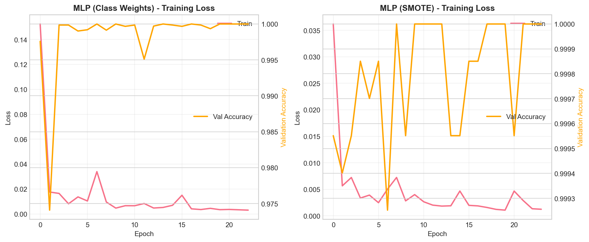
</p>
</details>

<details>
<summary><b>Sklearn — Confusion Matrices (All 5 Models)</b> (click to expand)</summary>
<br>
<p align="center">
  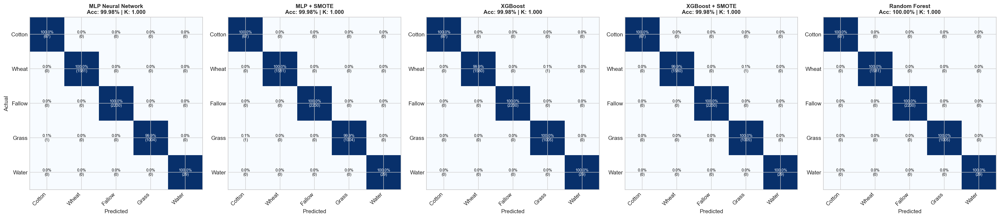
</p>
</details>

<details>
<summary><b>XGBoost — Feature Importance</b> (click to expand)</summary>
<br>
<p align="center">
  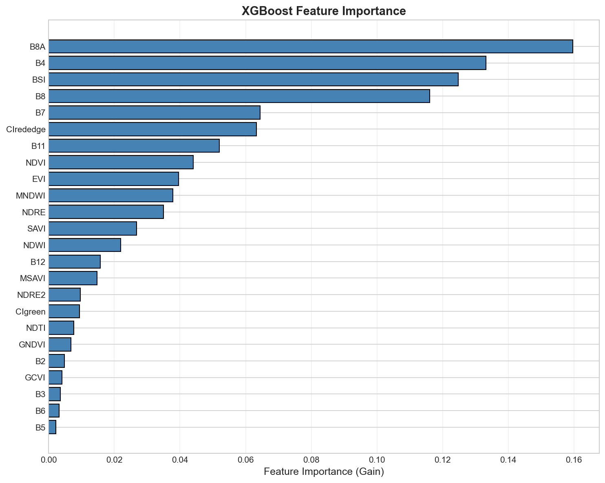
</p>
</details>

<details>
<summary><b>Per-Class Accuracy Comparison (All Sklearn Models)</b> (click to expand)</summary>
<br>
<p align="center">
  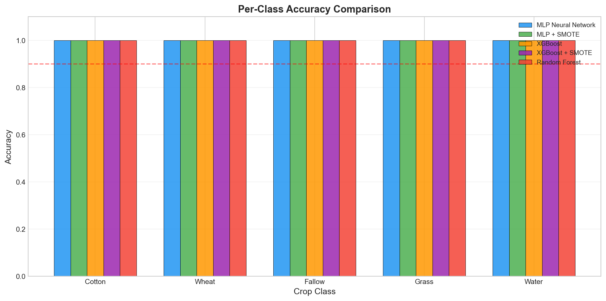
</p>
</details>

<details>
<summary><b>PyTorch — Training & Validation Loss Curves</b> (click to expand)</summary>
<br>
<p align="center">
  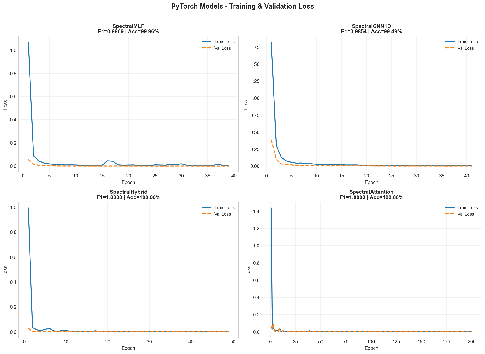
</p>
</details>

<details>
<summary><b>PyTorch — Confusion Matrices (All 4 Models)</b> (click to expand)</summary>
<br>
<p align="center">
  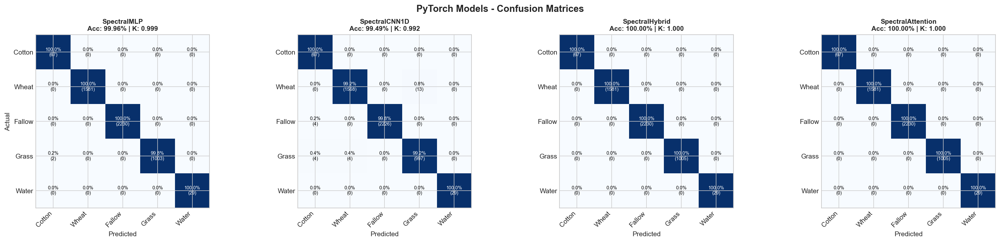
</p>
</details>

<details>
<summary><b>Classification Map Visualizations</b> (click to expand)</summary>
<br>

**Random Forest (sklearn)**
<p align="center">
  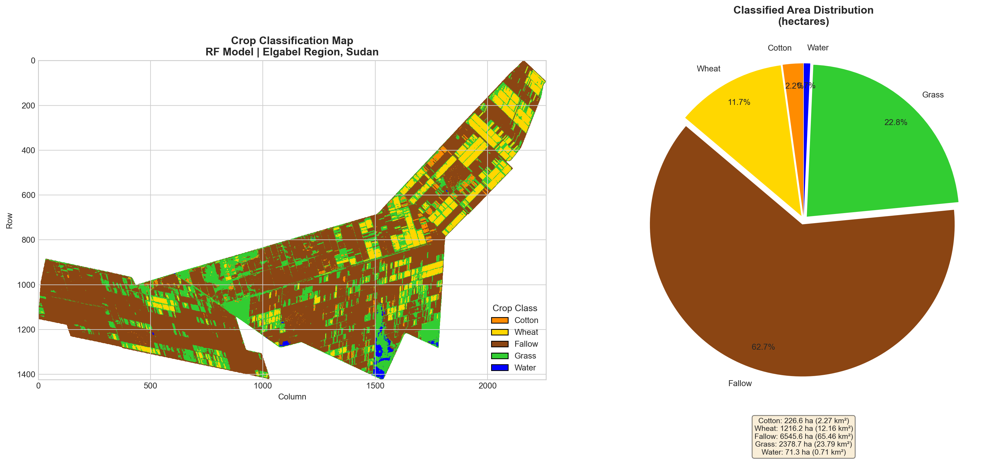
</p>

**SpectralHybrid (PyTorch)**
<p align="center">
  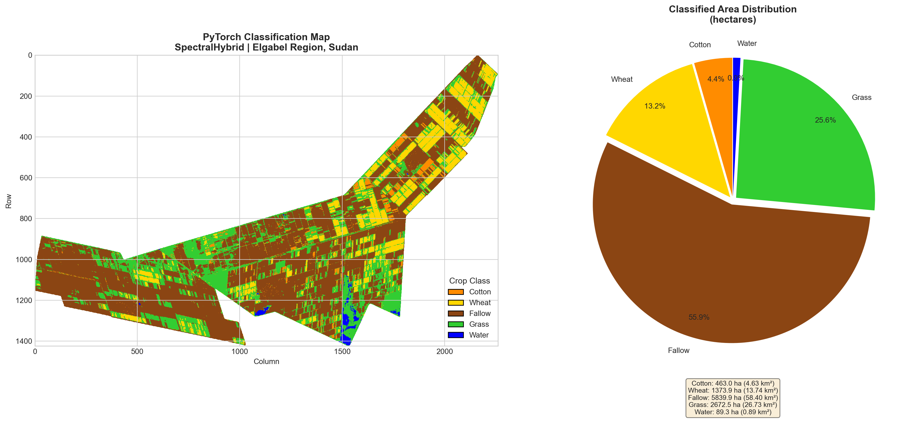
</p>
</details>

---

## Data Description

**24 spectral features** derived from a Sentinel-2 Q1 2020 composite:

| Category | Features |
|----------|----------|
| **Spectral Bands (10)** | B2, B3, B4, B5, B6, B7, B8, B8A, B11, B12 |
| **Vegetation Indices (14)** | NDVI, EVI, SAVI, NDRE, NDRE2, GNDVI, NDMI, BSI, MNDWI, LSWI, GCVI, WDRVI, CIgreen, CIrededge, MSAVI |

---

## Model Architectures

### Scikit-learn / XGBoost (Step 02)

| Model | Architecture | Imbalance Strategy |
|-------|-------------|-------------------|
| MLP Neural Network | 24 → 256 → 128 → 64 → 32 → 5 | Class weights |
| MLP + SMOTE | 24 → 512 → 256 → 128 → 64 → 32 → 5 | SMOTE oversampling |
| XGBoost | 500 trees, depth=8, lr=0.05 | Class weights |
| XGBoost + SMOTE | 500 trees, depth=8, lr=0.05 | SMOTE oversampling |
| Random Forest | 500 trees, balanced | Balanced class weights |

### PyTorch Deep Learning (Step 04)

| Model | Description | Key Features |
|-------|------------|-------------|
| SpectralMLP | Deep MLP (24 → 128 → 256 → 128 → 64 → 5) | BatchNorm, Dropout(0.3), FocalLoss |
| SpectralCNN1D | 1D CNN (32 → 64 → 128 filters) | Treats spectral bands as 1D signal |
| SpectralHybrid | CNN + MLP dual-branch fusion | Local + global feature extraction |
| SpectralAttention | Transformer-style | CLS token, 4 heads, 2 layers, GELU |

All PyTorch models use: **FocalLoss** (gamma=2), **AdamW** (weight_decay=1e-4), **ReduceLROnPlateau**, early stopping (patience=15), SMOTE-balanced data. Trained on **NVIDIA RTX 3050** (4GB VRAM).

---

## Project Structure

<details>
<summary><b>View full directory tree</b> (click to expand)</summary>
<br>

```
crop-classification-deep-learning/
├── .github/
│   ├── ISSUE_TEMPLATE/
│   │   ├── bug_report.md
│   │   └── feature_request.md
│   ├── workflows/
│   │   └── ci.yml
│   └── PULL_REQUEST_TEMPLATE.md
├── docs/                          # Result visualizations
│   ├── class_distribution.png
│   ├── feature_distributions.png
│   ├── feature_boxplots.png
│   ├── correlation_matrix.png
│   ├── training_history.png
│   ├── confusion_matrices.png
│   ├── feature_importance.png
│   ├── per_class_accuracy.png
│   ├── pytorch_training_curves.png
│   ├── pytorch_confusion_matrices.png
│   ├── classification_visualization.png
│   ├── truecolor_vs_classification.png
│   ├── pytorch_classification_visualization.png
│   └── pytorch_truecolor_vs_classification.png
├── gee/
│   └── crop_classification_gee.js
├── 01_data_exploration.py
├── 02_preprocessing_and_model.py
├── 03_apply_to_image.py
├── 03_diagnose_bands.py
├── 04_pytorch_models.py
├── 05_apply_pytorch_to_image.py
├── .gitignore
├── CHANGELOG.md
├── CITATION.cff
├── CONTRIBUTING.md
├── LICENSE
├── Makefile
├── README.md
├── environment.yml
├── fix_jupyter_kernel.bat
└── requirements.txt
```

</details>

---

## Setup

### Option A: Conda (recommended)

```bash
conda env create -f environment.yml
conda activate geodl
```

### Option B: pip

```bash
pip install -r requirements.txt
```

### Option C: Makefile

```bash
make setup        # conda
make setup-pip    # pip
```

### Register Jupyter kernel (optional)

```bash
fix_jupyter_kernel.bat
```

### 3. Obtain satellite data

Use the Google Earth Engine script in `gee/crop_classification_gee.js` to export:
- `S2_composite_24bands_2020_Q1.tif` — 24-band Sentinel-2 composite
- `S2_key_indices_2020_Q1.tif` — Key spectral indices
- `crop_training_data_5classes_2020.csv` — Labeled training samples

Place the exported files in the project root directory.

---

## Usage

Run the scripts in order:

```bash
# Step 1: Explore the training data
python 01_data_exploration.py

# Step 2: Train scikit-learn and XGBoost models
python 02_preprocessing_and_model.py

# Step 3: Apply best ML model to full satellite image
python 03_apply_to_image.py

# Step 4: Train PyTorch deep learning models (GPU recommended)
python 04_pytorch_models.py

# Step 5: Apply best PyTorch model to full satellite image
python 05_apply_pytorch_to_image.py
```

Or run the entire pipeline with one command:

```bash
make run-all
```

### Utility Scripts

- `03_diagnose_bands.py` — Diagnose band ordering between training data and GeoTIFF
- Run `make help` to see all available commands

---

## Google Earth Engine

The `gee/crop_classification_gee.js` script handles data acquisition:

1. Defines the study area (Elgabel Region, Sudan)
2. Filters Sentinel-2 Surface Reflectance (Q1 2020, <20% cloud cover)
3. Applies cloud masking using the SCL band
4. Computes a cloud-free median composite (10 spectral bands)
5. Calculates 14 spectral indices (NDVI, EVI, SAVI, NDRE, GNDVI, NDMI, BSI, MNDWI, LSWI, GCVI, WDRVI, CIgreen, CIrededge, MSAVI)
6. Samples training points from labeled polygons (5 classes)
7. Exports the 24-band composite and training CSV to Google Drive

---

## Contributing

Contributions are welcome! Please read the [Contributing Guidelines](CONTRIBUTING.md) before submitting a pull request.

---

## Citation

If you use this project in your research, please cite it:

```bibtex
@software{osman_crop_classification,
  title  = {Crop Classification with Deep Learning},
  author = {Osman},
  url    = {https://github.com/Osman-Geomatics93/crop-classification-deep-learning},
  license = {MIT}
}
```

You can also use the **"Cite this repository"** button on GitHub (powered by `CITATION.cff`).

---

## Changelog

See [CHANGELOG.md](CHANGELOG.md) for version history and release notes.

---

## License

This project is licensed under the MIT License. See [LICENSE](LICENSE) for details.
